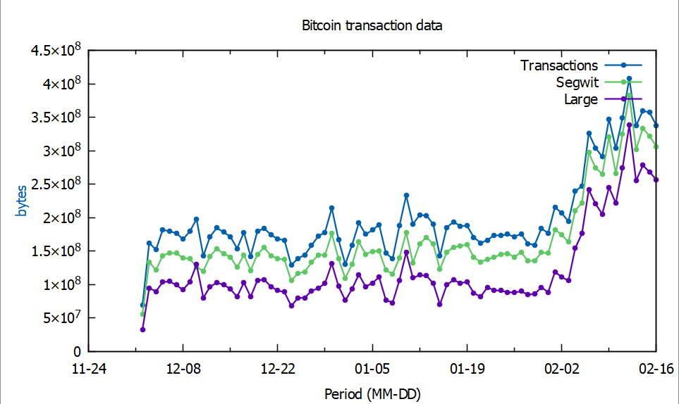

RedGrittyBrick Blockchain Parser
================================

The program `blockchain` parses a block file of the sort created by the 
Bitcoin Wallet named "Bitcoin Core". These block files hold raw
blockchain data in the form used to transmit data across the Bitcoin 
network.

The block files have names like blk00001.dat to blk03976.dat and are
stored in whatever directory is configured in the wallet. By default
on Windows this is in `%APPDATA%\Bitcoin\blocks`

The command-line program parses a specified block file and writes 
readable text data to standard output.

Basic Usage
-----------

To see the available options

    blockchain -help

To see the version / release number of the program

    blockchain -version

To list the blocks in a block file

    blockchain -file blk02255.dat -blocks

To list the transactions in a specific block

    blockchain -file blk02255.dat -block 22 -transactions

To show details of a specific transaction

    blockchain -file blk02255.dat -block 22 -tx 157

The block numbers and transaction numbers used with the 
`-block` and `-tx` options are relative to the file or block.
So block 5 is the fifth block in the specified file and
transaction 7 is the seventh transaction in the specified
block.

To list data in CSV format for further processing such as producing
statistics

    blockchain -file blk02255.dat -blocks -transactions -format csv
    
To process all the blockfiles on Windows you could use a batch
file such as 

    @echo off
    pushd %APPDATA%\Bitcoin\blocks
    for %%f in (blk*.dat) do (
        blockchain -file %%f -blocks -transactions -format csv
    )
    popd

You could pipe the output of this batch file into another program
to produce statistics or plot graphs

    allblocks.bat | csv2graph

---

Examples
--------

1 

    blocks> blockchain -file blk00001.dat
    blk00001.dat  11268 blk,  319034 tx,       0 segwit,  594649 ins,  738057 outs, 1.7929938s

2

    blocks> blockchain -file blk00001.dat -longstats

    Statistics for blk00001.dat (2011-04-22 to 2011-06-16)

     11268 blocks
    319034 transactions (mean 28.3, max 912 per block)
         0 Segwit tx    (0.0%)
    594649 inputs       (mean 1.9, max 536 per transaction)
    738057 outputs      (mean 2.3, max 544 per transaction)

    Processed file in 1.1251089s

3

    blocks> blockchain -file blk02000.dat -blocks
       No.|Version |Height|Date and Time   |   Txs|Target  |Id
    ------|--------|------|----------------|------|--------|----
         1|20400000|621578|2020-03-14 06:24|   580|17110119|0000000000000000000E19FE06F2A1D869BFAA55993E7DEA0E4B957387687A0F
         2|20800000|621624|2020-03-14 14:20|  2232|17110119|000000000000000000014EDF41ECC3377A0647917284488269379CD9D9DC5B75
         3|20200000|621595|2020-03-14 08:42|  1962|17110119|0000000000000000000BBF1B9AE2D65C86B6566C434C06FBC1C4B175641B9692
         4|7FFF0000|621532|2020-03-13 23:08|  2965|17110119|0000000000000000000C8C56C3B08CAA284D3449F9E7678D9DA155EB601D6352
         5|20C20000|621565|2020-03-14 04:19|  2088|17110119|0000000000000000000EF240A46572994841E02708ACE388D83F89D768E0C198
         ...
       108|20002000|621692|2020-03-15 05:25|   508|17110119|0000000000000000000AD4521ABC87DBA371D3AC9A7F96610D1EBD02E10FCAB4
       109|20000000|621699|2020-03-15 06:43|   358|17110119|00000000000000000007D82CBEC4A60A4E1B926412C8E9AC74B8C53215188C19
       110|20000000|621713|2020-03-15 10:41|   787|17110119|00000000000000000010BE602BF49BE601BA14C9318976FBDE4329A84DEA2DAD
       111|3FFFE000|621723|2020-03-15 12:15|  2311|17110119|00000000000000000009B359779204E2839CBA71C64BB0CF7D7D0F6778585FDC
       112|20C00000|621721|2020-03-15 11:54|   563|17110119|0000000000000000000C3800093DDA3099351B53D61BF48B9A005A37B2DEDC68

4

    blocks> blockchain -file blk02000.dat -block 100 -transactions
    Magic ......... 0xd9b4bef9
    BlockSize ..... 0x000076b1 = 30385
    Header:
      Version ..... 0x20800000 = 545259520
      Prev Blk Hash 0xfb8ab210ee599fc8db0a19a98ee1c7084494249c5de107000000000000000000
                    0x00000000000000000007e15d9c24944408c7e18ea9190adbc89f59ee10b28afb
      Merkle Root . 0x373675518a256c14b5ff8f137575e5ff8a811074d9866a54693aa47d9719c856
      TimeStamp ... 0x5e6e12ee = 2020-03-15 11:35:10 +0000 GMT
      DifficultyTgt 0x17110119
      Nonce ....... 0xf52f3c0e
    Transactions .. 78

    Summary of transactions in block 0000000000000000000B049D87D30DE0AB068B0E952956C0384018B54525C395
    ---

     No.|Bytes|V|Type  | Ins|Outs|Lock  |B  Satoshi |Id
    ----|-----|-|------|----|----|------|-----------|---
       1|  342|2|Segwit|   1|   4|     0| 1251031094|013226F2917E4A754496316F904CDEF9E6AA27AD702FC9E56CC72DE34CECCD2B
       2|  225|1|Legacy|   1|   2|     0|    2404374|F0C11B1F9D20DEAFB5E7E9837F791226FF4A91120BF8A4C23178482E1EC19307
       3|  257|2|Legacy|   1|   3|     0| 7575749829|0846D58AF5FA5582D368AE39B7AE9B76B86A09A3655854EBE94A2A28EC3917B8
       4|  195|1|Segwit|   1|   1|     0|    1071728|45782D0D0D35152C22FDAA1A1DAA12D6B8810AD4CFED3F74848FCD87ED1338ED
       5|  249|2|Segwit|   1|   2|     0|  462249812|7EBBCCB12B88560D976AC1553AEE3A48D2DE38B178788C226AB2622E5A7F7E48
       ...
      74|  284|1|Segwit|   1|   2|     0|      73560|80E5B2293CD68462302CC5A1BC2C05D8E5136F192CA47D3F453A8883781AE902
      75|  406|2|Legacy|   2|   3|621717|    2033620|68E8338AED8CC051BBEACCF203B7F92BF86DC0E8D503BF0C5481879B3D44A3B6
      76|  406|2|Legacy|   2|   3|621717|    2010081|68C79DD899758774A749798CFC6EB5D7DDFB1A26AA89A3B4F116C1FB23FCFFD4
      77|  225|2|Legacy|   1|   2|621717|     294219|7688FFEE50A26E6F4096D10673A5232F5379EA88D6580329D3CD6FE1775FFB73
      78|  225|2|Legacy|   1|   2|621717|      74719|908D2CEC7F3544E32F36FFEF1780FAF54E3C7D50D5D706BAE457DCFAD2585A88

5

    blocks> blockchain -file blk02000.dat -block 100 -tx 10 -format md

    Block `0000000000000000000B049D87D30DE0AB068B0E952956C0384018B54525C395`

    Hexadecimal Data                                                 | Meaning
    -----------------------------------------------------------------|---------
    D9B4BEF9                                                         | Magic
    000076B1                                                         | BlockSize 30385
    20800000                                                         | Version
    00000000000000000007E15D9C24944408C7E18EA9190ADBC89F59EE10B28AFB | Prevous Block Hash
    373675518A256C14B5FF8F137575E5FF8A811074D9866A54693AA47D9719C856 | Merkle Root
    5E6E12EE                                                         | TimeStamp 2020-03-15 11:35:10 +0000 GMT
    17110119                                                         | Difficulty Target
    F52F3C0E                                                         | Nonce
    4E                                                               | Transactions 78

    Transaction `10AD6D68C9E2F0DF9A040BF82DCDCE36939D99D947B97F3472BD2C57EA39A5A1`

    Hexadecimal Data                                                 | Meaning
    -----------------------------------------------------------------|---------
    01000000                                                         | Version = 1
    0001                                                             | Type Segwit
    01                                                               | 1 Inputs
    751EB6F42A9B62D9D4B39E82BE80A28EB9EADE26FB73495529FBA8B8EA394453 | Input 1 : Previous Transaction ID
    0001                                                             | Input 1 : Previous Output Index 1
    00                                                               | Input 1 : Script Length 0
                                                                     | Input 1 : Unlocking script
    FFFFFFFF                                                         | Input 1 : Sequence
    02                                                               | 2 Outputs
    A43BB50100000000                                                 | Output 1 : Value 28654500
    19                                                               | Output 1 : Script Length 25
    76A9144EE2EF411366ECCF98BD3B18E938EB7820ADD62388AC               | Output 1 : Locking script
    23DD855B00000000                                                 | Output 2 : Value 1535499555
    16                                                               | Output 2 : Script Length 22
    001433117AED7E0FCACD7DB83A70EEDDAAE6A758ABE7                     | Output 2 : Locking script
    02                                                               | Witness 1 : Item Count 2
    48                                                               | Witness 1 : Item 1 : Length = 72
    3045022100B93EE3BDAD8AF7ED95099CE5321B4485EF820730AF88BDF51E28D2 | Witness 1 : Item 1 : Data
    74360FE4160220636A7FB2FA930B128C6FD66CF4AA7F15A45F609F49402FC4C3 | Witness 1 : Item 1 : ...
    B0DAB51CB2E2A301                                                 | Witness 1 : Item 1 : ...
    21                                                               | Witness 1 : Item 2 : Length = 33
    023189C8D0121EE6DE905E3667B136955A5376603C764B1D96CB4D0186152A66 | Witness 1 : Item 2 : Data
    2A                                                               | Witness 1 : Item 2 : ...
    00000000                                                         | LockTime 0

    ---

Example Graph
=============

As an example of using this to extract statistics I wrote the following

csvstats.exe
: extracts statistics as CSV from  the output of `blockchain -file blknnnn.dat -blocks -transactions -format csv`

csvstats.go
: Source code for the above

blocks2csv.bat
: runs `blockchain.exe` against several blockfiles and feeds output to `csvstats`

gnuplot.plt
: GNUPlot command file to create graph from csvstats output

graph.png
: Graph created by GNUplot

